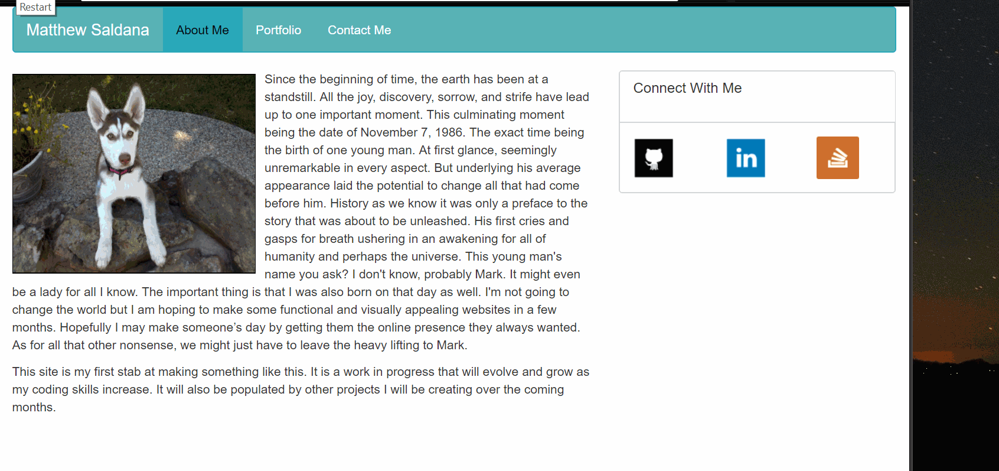

# Bootstrap-Portfolio

A basic portfolio made to get familiar with Bootstrap and its responsive grid system.  The page adjust itself to fit several different screen sizes. 

A Nav bar leads to different parts of the site and the links in the side bar lead to my Github, LinkedIn, and Stack Overflow profiles.

